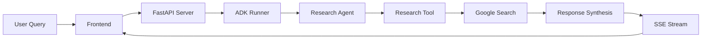

# Gemini Research Agent - Google ADK

A fullstack AI research assistant powered by Google Agent Development Kit (ADK) and Gemini API. This application demonstrates building intelligent conversational AI that can perform web research, answer questions in Vietnamese, and provide real-time information with source citations.


## Features

- 🤖 **AI Research Assistant**: Powered by Google Gemini and Agent Development Kit
- 🔍 **Real-time Web Search**: Integrated Google Search with source attribution  
- 🇻🇳 **Vietnamese Language Support**: Natural responses in Vietnamese
- 📡 **Streaming Responses**: Real-time response streaming with activity timeline
- 🌐 **Modern Web Interface**: React frontend with beautiful UI components
- ⚡ **High Performance**: Optimized for speed and reliability
- 🔄 **Hot Reloading**: Development-friendly with automatic reloading

## Technology Stack

### Frontend
- **React 19** with TypeScript
- **Vite** for fast development and building
- **Tailwind CSS** for styling
- **Shadcn/ui** components
- **React Markdown** for rendering responses

### Backend  
- **Google Agent Development Kit (ADK)**
- **Google Gemini API** (2.0 Flash, 2.5 Flash, 2.5 Pro)
- **FastAPI** for HTTP server
- **Google Search** integration for web research
- **Server-Sent Events (SSE)** for streaming

## Project Structure

```
├── frontend/           # React application
│   ├── src/
│   │   ├── components/ # UI components  
│   │   ├── lib/        # Utilities
│   │   └── App.tsx     # Main application
│   ├── package.json
│   └── vite.config.ts
├── backend/            # Python backend
│   ├── src/agent/
│   │   ├── server.py   # FastAPI server
│   │   ├── prompts.py  # AI prompts and configurations
│   │   └── adk_agent.py # ADK agent implementation
│   └── pyproject.toml
├── Makefile           # Development commands
└── README.md
```

## Prerequisites

Before getting started, make sure you have:

- **Node.js 18+** and npm
- **Python 3.11+** 
- **Google Gemini API Key** - Get yours from [Google AI Studio](https://aistudio.google.com/app/apikey)

## Quick Start

### 1. Clone and Setup Environment

```bash
git clone <repository-url>
cd a2a-client
```

### 2. Configure Google Gemini API

Create a `.env` file in the `backend/` directory:

```bash
cd backend
cp .env.example .env
```

Edit `.env` and add your API key:
```env
GEMINI_API_KEY="your_actual_gemini_api_key_here"
```

### 3. Install Dependencies

**Backend:**
```bash
cd backend
python -m venv .venv
source .venv/bin/activate  # On Windows: .venv\Scripts\activate
pip install -e .
```

**Frontend:**
```bash
cd frontend
npm install
```

### 4. Test the ADK Agent

Before running the servers, test that the ADK agent is working:

```bash
make test-agent
# Or manually: cd backend && source .venv/bin/activate && python test_adk_agent.py
```

### 5. Run Development Servers

**Option A: Run both servers with one command**
```bash
make dev
```

**Option B: Run servers separately**

Backend (Terminal 1):
```bash
make dev-backend
# Or manually: cd backend && source .venv/bin/activate && python -m uvicorn src.agent.server:app --host 0.0.0.0 --port 2024 --reload
```

Frontend (Terminal 2):
```bash
make dev-frontend  
# Or manually: cd frontend && npm run dev
```

### 6. Access the Application

Open your browser and navigate to:
- **Frontend**: http://localhost:5173/app/
- **Backend API**: http://localhost:2024
- **API Documentation**: http://localhost:2024/docs

## How It Works

### 1. ADK Agent Architecture

The application now uses Google Agent Development Kit (ADK) with a properly structured agent:

1. **LlmAgent**: Core intelligence powered by Gemini 2.0 Flash
2. **Tools Integration**: `conduct_comprehensive_research` tool handles the entire research pipeline
3. **Automatic Research**: Agent autonomously decides when and how to use research tools
4. **Intelligent Orchestration**: ADK manages tool calls, context, and response generation

### 2. Research Pipeline

The research tool (`conduct_comprehensive_research`) follows this process:

1. **Query Analysis**: Analyzes user question and determines research strategy
2. **Web Research**: Uses Google Search with grounding for current information
3. **Quality Analysis**: Evaluates research quality and completeness
4. **Answer Synthesis**: Creates comprehensive response with Gemini
5. **Source Attribution**: Includes relevant sources and citations

### 3. Streaming Architecture



The application uses Server-Sent Events (SSE) for real-time streaming:
- **generate_query**: Shows search query generation
- **web_research**: Displays found sources  
- **reflection**: Shows analysis progress
- **finalize_answer**: Presents final response
- **message**: Sends complete answer with sources

### 3. Supported Features

- **Weather Queries**: Real-time weather information
- **News & Current Events**: Latest news and updates
- **General Questions**: Knowledge-based Q&A
- **Vietnamese Responses**: Natural language in Vietnamese
- **Source Attribution**: Links to original sources
- **Multiple Models**: Choose between Gemini 2.0/2.5 variants

## Configuration

### Model Selection

The application supports multiple Gemini models:
- `gemini-2.0-flash`: Fast responses, good for general queries
- `gemini-2.5-flash-preview-04-17`: Enhanced capabilities  
- `gemini-2.5-pro-preview-05-06`: Most advanced reasoning

### Research Intensity

Configure research depth:
- **Low**: 1 search query, 1 research loop
- **Medium**: 3 search queries, 3 research loops  
- **High**: 5 search queries, 10 research loops

### Prompts Customization

Edit `backend/src/agent/prompts.py` to customize:
- System instructions
- Research prompts
- Error messages
- Model configurations

## API Endpoints

### Core Endpoints

- `POST /assistants/{id}/runs` - Create research session
- `GET /health` - Health check with system status
- `GET /` - API information and capabilities

### Example API Usage

```bash
curl -X POST http://localhost:2024/assistants/agent/runs \
  -H "Content-Type: application/json" \
  -d '{
    "messages": [{"type": "human", "content": "Thời tiết Hà Nội hôm nay?", "id": "1"}],
    "initial_search_query_count": 3,
    "max_research_loops": 2,
    "reasoning_model": "gemini-2.0-flash"
  }'
```

## Development

### Available Commands

```bash
make help              # Show available commands
make install-backend   # Install backend dependencies  
make dev-frontend      # Start frontend dev server
make dev-backend       # Start backend dev server
make dev               # Start both servers
```

### File Structure

- `server.py`: Main FastAPI application
- `prompts.py`: AI prompts and configurations
- `adk_agent.py`: Google ADK agent implementation
- Frontend components in `frontend/src/components/`

### Adding New Features

1. **New Prompts**: Add to `prompts.py`
2. **API Endpoints**: Extend `server.py`
3. **UI Components**: Create in `frontend/src/components/`
4. **Agent Logic**: Modify `adk_agent.py`

## Deployment

### Production Build

1. **Build Frontend**:
```bash
cd frontend && npm run build
```

2. **Configure Environment**:
```bash
export GEMINI_API_KEY="your_production_key"
```

3. **Run Production Server**:
```bash
cd backend && python -m uvicorn src.agent.server:app --host 0.0.0.0 --port 2024
```

### Docker Deployment

```bash
docker build -t gemini-research-agent .
docker run -e GEMINI_API_KEY="your_key" -p 2024:2024 gemini-research-agent
```

## Troubleshooting

### Common Issues

1. **API Key Error**: Ensure `GEMINI_API_KEY` is set correctly
2. **Port Conflicts**: Change ports in `vite.config.ts` and `server.py`
3. **Dependencies**: Run `pip install -e .` and `npm install`
4. **Virtual Environment**: Activate with `source .venv/bin/activate`

### Debugging

- Check backend logs: `make dev-backend`
- Test API directly: `curl http://localhost:2024/health`
- Frontend proxy: Verify `vite.config.ts` proxy settings

## Contributing

1. Fork the repository
2. Create a feature branch: `git checkout -b feature-name`
3. Make changes and test thoroughly
4. Submit a pull request

## License

This project is licensed under the MIT License. See the [LICENSE](LICENSE) file for details.

## Acknowledgments

- **Google Agent Development Kit** for the AI framework
- **Google Gemini** for the language models
- **Google Search** for web research capabilities
- **React** and **FastAPI** communities for excellent tools 