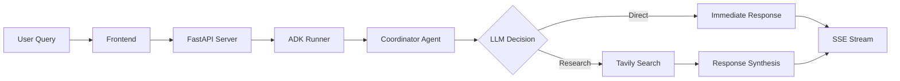

# Gemini Research Agent - Google ADK

A fullstack AI research assistant powered by Google Agent Development Kit (ADK) and Gemini API. This application demonstrates building intelligent conversational AI that can perform web research, answer questions in Vietnamese, and provide real-time information with source citations.


## Features

- 🤖 **AI Research Assistant**: Powered by Google Gemini and Agent Development Kit
- 🧠 **Smart Coordinator Agent**: Automatically decides whether to answer directly or use web research using LLM reasoning
- 🔍 **Real-time Web Search**: Integrated Tavily Search with source attribution  
- ⚡ **Direct Answer Mode**: Instant responses for personal questions and basic knowledge
- 🇻🇳 **Vietnamese Language Support**: Natural responses in Vietnamese
- 📡 **Streaming Responses**: Real-time response streaming with activity timeline
- 🌐 **Modern Web Interface**: React frontend with beautiful UI components
- ⚡ **High Performance**: Optimized for speed and reliability
- 🔄 **Hot Reloading**: Development-friendly with automatic reloading

## Technology Stack

### Frontend
- **React 19** with TypeScript
- **Vite** for fast development and building
- **Tailwind CSS** for styling
- **Shadcn/ui** components
- **React Markdown** for rendering responses

### Backend  
- **Google Agent Development Kit (ADK)**
- **Google Gemini API** (2.0 Flash, 2.5 Flash, 2.5 Pro)
- **FastAPI** for HTTP server
- **Tavily Search** integration for web research
- **Server-Sent Events (SSE)** for streaming

## Project Structure

```
├── frontend/           # React application
│   ├── src/
│   │   ├── components/ # UI components  
│   │   ├── lib/        # Utilities
│   │   └── App.tsx     # Main application
│   ├── package.json
│   └── vite.config.ts
├── backend/            # Python backend
│   ├── src/agent/
│   │   ├── server.py           # FastAPI server
│   │   ├── prompts.py          # AI prompts and configurations  
│   │   └── adk_agent_workflow.py # ADK agent implementation
│   ├── test_coordinator.py     # Coordinator agent tests
│   ├── test_llm_reasoning.py   # LLM reasoning tests
│   └── pyproject.toml
├── Makefile           # Development commands
└── README.md
```

## Prerequisites

Before getting started, make sure you have:

- **Node.js 18+** and npm
- **Python 3.11+** 
- **Google Gemini API Key** - Get yours from [Google AI Studio](https://aistudio.google.com/app/apikey)
- **Tavily API Key** - Get yours from [Tavily](https://tavily.com) for web search functionality

## Quick Start

### 1. Clone and Setup Environment

```bash
git clone <repository-url>
cd a2a-client
```

### 2. Configure API Keys

Create a `.env` file in the `backend/` directory:

```bash
cd backend
cp .env.example .env
```

Edit `.env` and add your API keys:
```env
GEMINI_API_KEY="your_actual_gemini_api_key_here"
TAVILY_API_KEY="your_actual_tavily_api_key_here"
```

### 3. Install Dependencies

**Backend:**
```bash
cd backend
python -m venv .venv
source .venv/bin/activate  # On Windows: .venv\Scripts\activate
pip install -e .
```

**Frontend:**
```bash
cd frontend
npm install
```

### 4. Test the Coordinator Agent

Before running the servers, test that the coordinator agent is working:

```bash
# Test Coordinator Agent
make test-coordinator

# Test LLM Reasoning Capability
make test-llm-reasoning
```

### 5. Run Development Servers

**Option A: Run both servers with one command**
```bash
make dev
```

**Option B: Run servers separately**

Backend (Terminal 1):
```bash
make dev-backend
```

Frontend (Terminal 2):
```bash
make dev-frontend  
```

### 6. Access the Application

Open your browser and navigate to:
- **Frontend**: http://localhost:5173/app/
- **Backend API**: http://localhost:2024
- **API Documentation**: http://localhost:2024/docs

## How It Works

### 1. Smart Coordinator Agent Architecture

The application uses a **single intelligent coordinator agent** that combines:

1. **LLM-Powered Decision Making**: Uses natural language understanding to classify questions
2. **Built-in Web Search**: Has tavily_research_tool integrated for real-time information
3. **Direct Answer Capability**: Handles questions that don't require real-time information
4. **Adaptive Response**: No hard-coded rules - LLM decides based on context

#### Intelligent Question Classification:

Instead of rigid rules, the system uses **LLM reasoning** to determine response approach:

🧠 **LLM asks itself:**
- "Does this question need real-time information?"
- "Can I answer accurately with my existing knowledge?"
- "Could this information change over time?"
- "Is this a personal greeting or basic knowledge?"

**Examples of LLM reasoning:**

✅ **Direct Answer** (LLM reasoning: "Static knowledge, doesn't change"):
- "Chào bạn, tôi là Thái" → Personal introduction
- "2+2=?" → Mathematical fact  
- "Thủ đô Việt Nam là gì?" → Geographic fact

🔍 **Web Research** (LLM reasoning: "Needs current data"):
- "Thời tiết Hà Nội hôm nay" → Real-time weather
- "Giá bitcoin hiện tại" → Live market data
- "Tin tức mới nhất về AI" → Current events

This approach is more **flexible**, **intelligent**, and **adaptive** than hard-coded rules.

### 2. Workflow Process

The coordinator agent follows this intelligent process:

1. **Question Analysis**: Analyzes user question using LLM reasoning
2. **Decision Making**: Decides between direct answer or web research
3. **Direct Response**: For personal/basic questions, responds immediately
4. **Web Research**: For current information, uses Tavily Search API
5. **Answer Synthesis**: Creates comprehensive response in Vietnamese
6. **Source Attribution**: Includes relevant sources and citations when applicable

### 3. Streaming Architecture



## Testing

### Coordinator Agent Tests

Test different types of questions to see how the coordinator agent responds:

```bash
# Test coordinator functionality
make test-coordinator

# Test LLM reasoning with various question types
make test-llm-reasoning
```

**Example test cases:**
- Personal questions: "Tôi là Thái", "Chào bạn"
- Basic knowledge: "2+2=?", "Thủ đô Việt Nam"
- Current information: "Thời tiết hôm nay", "Giá vàng hiện tại"

## Environment Variables

| Variable | Description | Required | Example |
|----------|-------------|----------|---------|
| `GEMINI_API_KEY` | Google Gemini API key | Yes | `AIza...` |
| `TAVILY_API_KEY` | Tavily Search API key | Yes | `tvly-...` |

## Development Commands

| Command | Description |
|---------|-------------|
| `make dev` | Start both frontend and backend |
| `make dev-backend` | Start backend only |
| `make dev-frontend` | Start frontend only |
| `make install-backend` | Install backend dependencies |
| `make test-coordinator` | Test coordinator agent |
| `make test-llm-reasoning` | Test LLM reasoning capability |

## API Endpoints

### POST `/assistants/{assistant_id}/runs`

Create a new conversation run with the AI assistant.

**Request Body:**
```json
{
  "messages": [
    {
      "type": "user",
      "content": "Thời tiết Hà Nội hôm nay thế nào?"
    }
  ],
  "reasoning_model": "gemini-2.0-flash",
  "initial_search_query_count": 3,
  "max_research_loops": 3
}
```

**Response:** Server-Sent Events stream with research progress and final answer.

### GET `/health`

Check API health status and configuration.

## Troubleshooting

### Common Issues

1. **API Key Not Working**
   - Verify your API keys in `.env` file
   - Check API key permissions on respective platforms

2. **Backend Won't Start**
   - Ensure Python virtual environment is activated
   - Check all dependencies are installed: `pip install -e .`

3. **Frontend Can't Connect**
   - Verify backend is running on port 2024
   - Check CORS configuration in server.py

4. **No Web Search Results**
   - Verify Tavily API key is valid
   - Check internet connection
   - Review Tavily account quota

## Contributing

1. Fork the repository
2. Create a feature branch: `git checkout -b feature/your-feature`
3. Make your changes and test thoroughly
4. Commit your changes: `git commit -am 'Add some feature'`
5. Push to the branch: `git push origin feature/your-feature`
6. Submit a pull request

## License

This project is licensed under the MIT License - see the [LICENSE](LICENSE) file for details.

## Acknowledgments

- Google Agent Development Kit (ADK) team
- Gemini API for powerful language models
- Tavily for web search capabilities
- Shadcn/ui for beautiful React components 